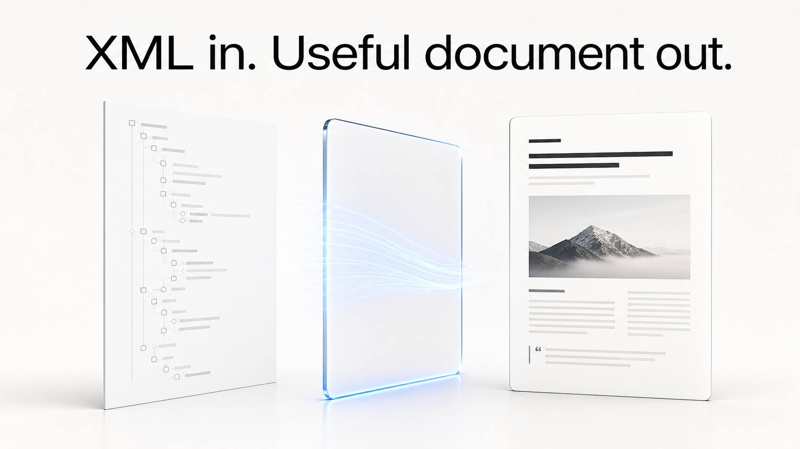

# XSLT-Transformer

<p align="center">
  
</p>

**A small desktop surface for one precise job: transform XML with an XSL stylesheet and save the result.**

Instead of opening a terminal or wiring a script, choose an XML document, choose an `.xsl` or `.xslt` stylesheet, choose an output path, and run the transformation. The application uses `lxml`, so validation and transformation errors are shown in the interface.

## Start here

On Windows, download and open [XSLT-Transformer.exe](XSLT-Transformer.exe). To understand or run the source version, begin with [transformar.py](transformar.py):

```bash
pip install lxml customtkinter
python transformar.py
```

Select one XML file and one XSL or XSLT stylesheet; the third selector sets the output path. The default output is output.html in your home directory. The result may be HTML, XML, or any format your stylesheet emits.

## What is in the repository

- `transformar.py` — the CustomTkinter application.
- `XSLT-Transformer.exe` — a Windows build for direct use.

The project deliberately stays local: the files are transformed on the machine where the application runs.
